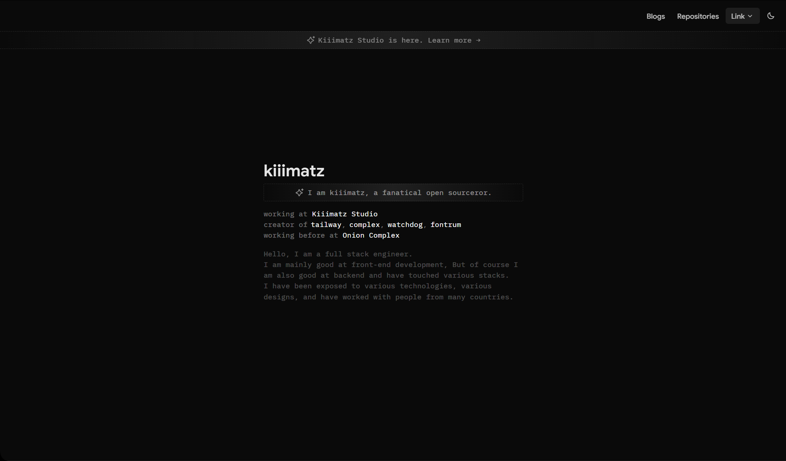
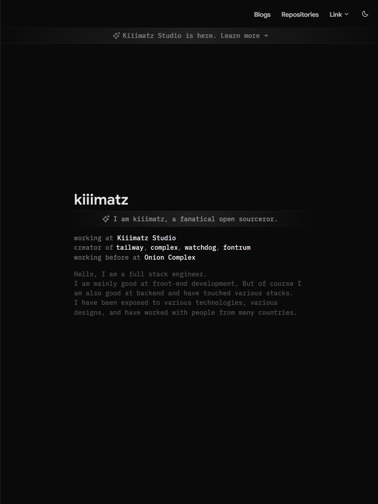
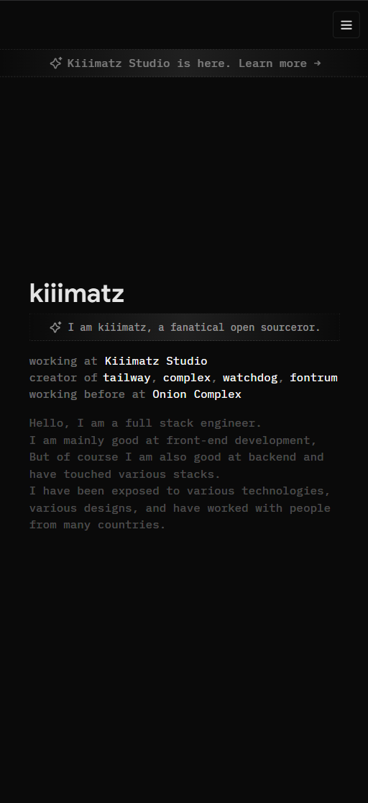

# kiiimatz — Portfolio

Personal portfolio site built with SvelteKit.



<p align="center">
  
  
</p>

## Tech Stack

| Category | Technology |
|----------|-----------|
| Framework | [SvelteKit](https://kit.svelte.dev/) + TypeScript |
| Styling | [Tailwind CSS v4](https://tailwindcss.com/) |
| UI Components | [shadcn-svelte](https://www.shadcn-svelte.com/) / [bits-ui](https://bits-ui.com/) |
| CMS | [microCMS](https://microcms.io/) |
| Package Manager | [Bun](https://bun.sh/) |

## Pages

- `/` — Home / About
- `/blogs` — Blog list (powered by microCMS)
- `/repositories` — OSS repository list

## Getting Started

### Prerequisites

- [Bun](https://bun.sh/) >= 1.0

### Install

```sh
bun install
```

### Environment Variables

Create a `.env` file in the project root:

```env
VITE_MICROCMS_DOMAIN=your-service-domain
VITE_MICROCMS_API_KEY=your-api-key
```

### Development

```sh
bun dev
```

### Build

```sh
bun run build
bun run preview
```

## License

MIT
